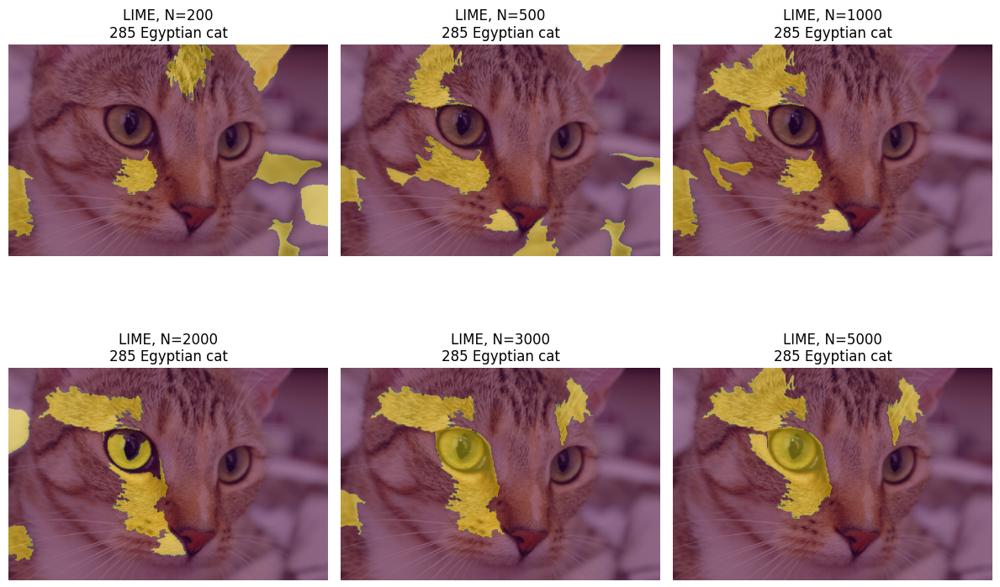
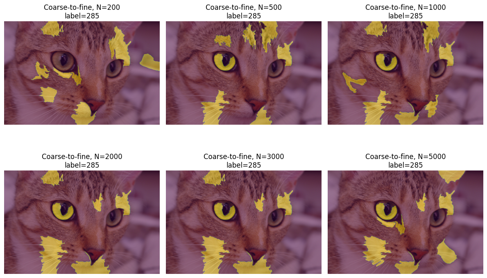

# Reliable LIME under Query Budget Constraints

This project studies the reliability of LIME image explanations under limited query budgets. While the original [LIME](https://arxiv.org/abs/1602.04938) paper mainly presents qualitative image examples, this project builds a quantitative evaluation pipeline for `lime_image` and investigates how explanation quality changes as the query budget decreases.  

Additionally, we propose a coarse-to-fine budget allocation strategy to improve explanation effectiveness under limited query budgets. When the query budget is large enough, our method may perform similarly to vanilla LIME. However, under smaller budgets, our method can identify meaningful image regions earlier, making LIME more practical for real-world settings where model queries may be costly or limited.  

## Qualitative Example  
Based on human visual prior knowledge, the eye and facial regions are semantically meaningful cues for recognizing cats. In the vanilla LIME result, the explanation starts to clearly highlight the eye region around a query budget of 2000. In contrast, our coarse-to-fine method highlights the eye region at a much lower budget, around 500 queries. This suggests that our method can identify meaningful image regions earlier under limited query budgets.  

**Vanilla LIME**  
  
**Coarse-to-Fine LIME**

## Environment setup
This project was developed and tested on **Windows 11** and  **[Python 3.8.10](https://www.python.org/downloads/release/python-3810/)**.

| Package      | Version      |
| ------------ | ------------ |
| python       | 3.8.10       |
| numpy        | 1.24.4       |
| scipy        | 1.10.1       |
| scikit-learn | 1.0.2        |
| scikit-image | 0.21.0       |
| matplotlib   | 3.7.5        |
| PyTorch      | 2.2.2+cu121  |
| torchvision  | 0.17.2+cu121 |  

To install the required packages, please run:  
`pip install -r requirements.txt`  
**Note:** The `requirements.txt` file was generated from the original development environment. Some platform-specific packages may not be required on other systems. If PyTorch installation fails, please install PyTorch manually from the official [PyTorch](https://pytorch.org/) website based on your system.  

## How to reproduce
1. For implementation details, please check the `coarse2fine_LIME.ipynb` notebook, which contains the experiment pipeline and step by step instructions.
2. For the technical report and presentation material, please check the `./presentation&report` folder.

## Reference

1. Ribeiro M T, Singh S, Guestrin C. " Why should i trust you?" Explaining the predictions of any classifier[C]//Proceedings of the 22nd ACM SIGKDD international conference on knowledge discovery and data mining. 2016: 1135-1144.
2. Official LIME repository: https://github.com/marcotcr/lime
3. Reference implementation used in this project: https://github.com/marcotcr/lime/blob/master/lime/lime_image.py

## Authors

- Qihang Feng qfeng5@ualberta.ca
- Wonki Byun wonki@ualberta.ca
- Zixi Chai zchai3@ualberta.ca
